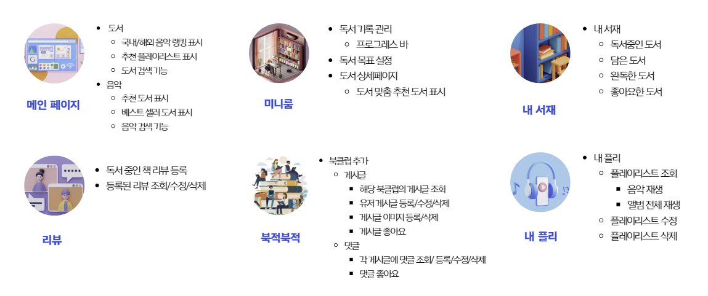
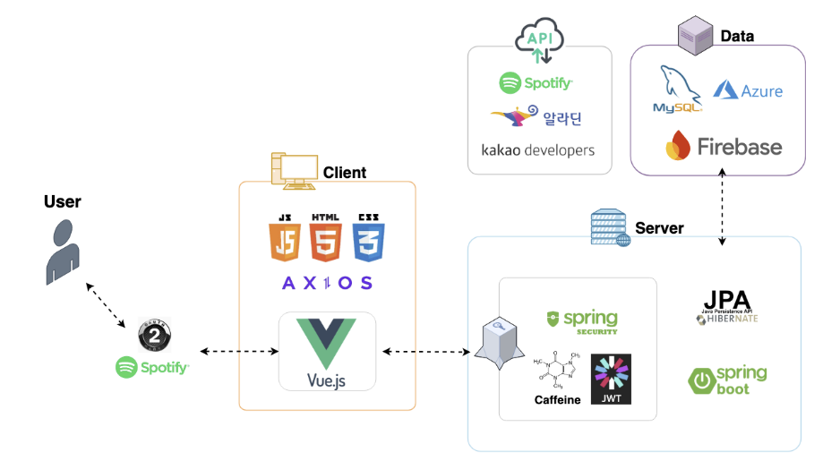
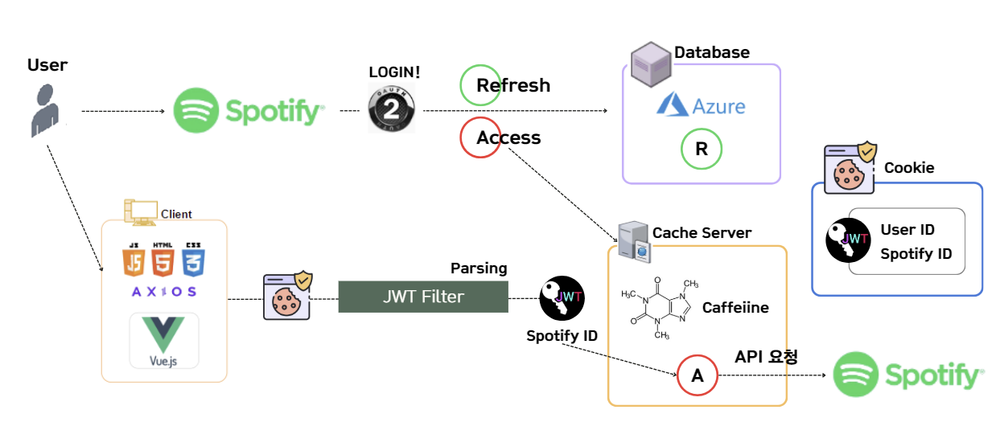
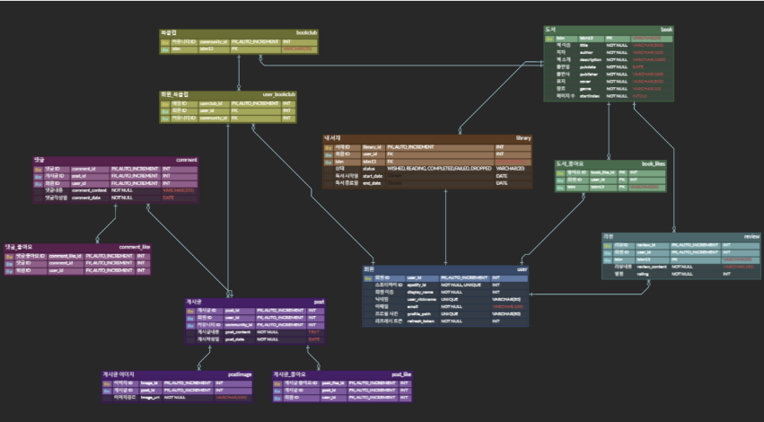

# BOOKPLI

## 프로젝트 소개
Spotify API를 이용한 음원 스트리밍과 함께 독서 활동을 기록하고 공유하는 플랫폼
 
 

## 팀 소개
- **KOSA 송파 3기**
- **개발 기간**: 11/26 ~ 12/30
- **팀장**: 이경진
- **팀원**: 배영재, 서샘이, 양수민
 

## 팀원별 맡은 역할
### 이경진
- OAuth 2.0 스포티파이 API 로그인
- 내 서재 페이지
  - 도서 좋아요, 담기 기능 유틸 메서드로 구현
- 내 플레이리스트 페이지
- 음악 상세 모달창
- 회원 정보 확인 / 수정 모달창
- 알림 / 확인 모달창 공용 구현
- 모놀리식 프로젝트 MSA로 변환
 

## 주요 기능

 

## 시스템 아키텍처

 

## 로그인 로직

 

## ERD
- USER
- USER_BOOKCLUB
- POST
- POSTIMAGE
- POST_LIKE
- LIBRARY
- COMMENT
- COMMENT_LIKE
- BOOK
- BOOK_LIKE
- REVIEW
- BOOKCLUB

 
